# FlashFinder

Flash Finder is a mobile application developed for the tattoo industry, combining social interaction
and appointment booking within a single platform. 

---

The platform is designed for two user roles:

- **Artists** - Can manage their availability, confirm appointment requests, showcase tattoo designs and healed work to exclusive galleries
- **Clients** - Can browse profiles, follow artists, send messages, request appointments and post to the main feed. 

## Tech Stack
FlashFinder was built using the following: 
- **React Native**
- **Expo**
- **JavaScript**
- **Supabase**
  - Authentication
  - PostgreSQL Database
  - Storage
  - Row Level Security (RLS)
### Development / Testing Tools
- **Android Studio**
- **GenyMotion**

---

## Main Features

### Authentication and Role-Based Access
- Sign up and login system using Supabase Authentication 
- Two user roles: **Artist** and **Client**
- Role-based feature visibility for exclusive artist features

   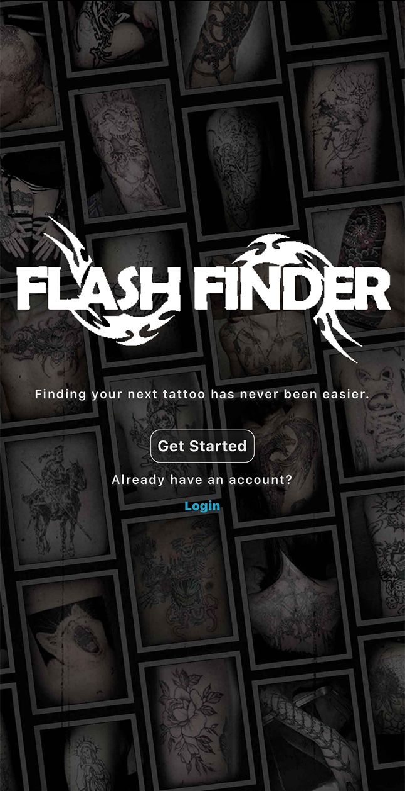
   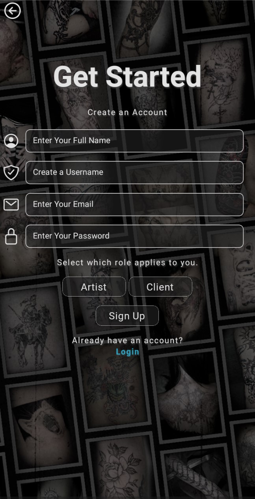
   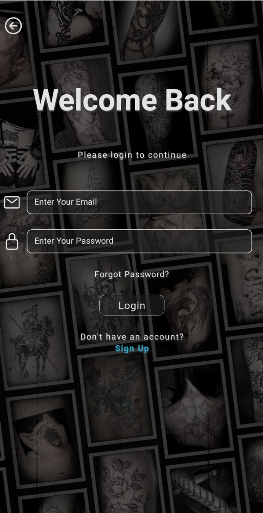

### Profile Management
- Editable user profiles
- Profile picture uploading 
- Artist and Client profile browsing 

   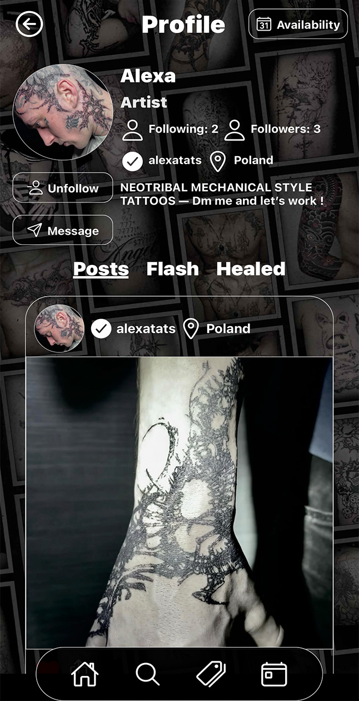
   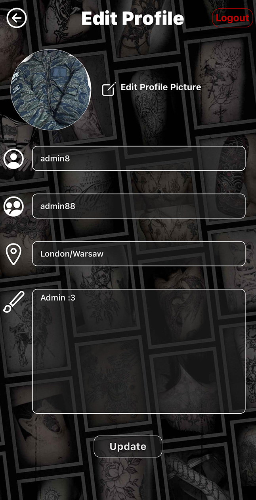

## Artist Features
- Availability Calendar
- Flash Feed to promote flash designs (Premade Tattoo Designs), to followers
- Healed Gallery for completed healed tattoo work 
- Dedicated posting options for artist content 

   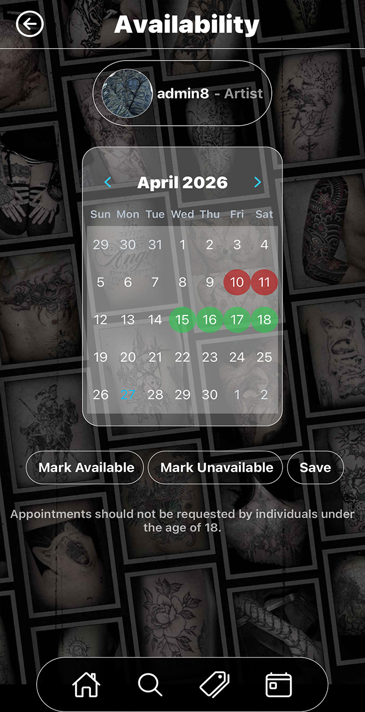
   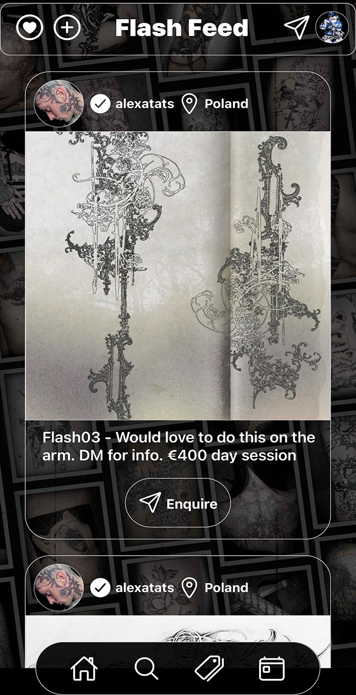

## Messaging and Booking 
- Direct messaging between users
- Appointment requests linked to artist availability
- Artist booking approval and decline workflow 

   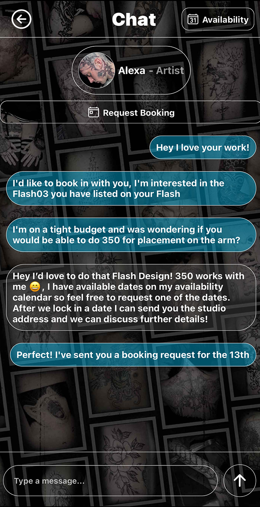
   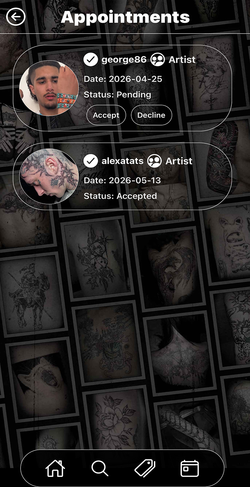

## Notifications and Search
- Notification page to display like and follow interactions 
- Search for users and posts

   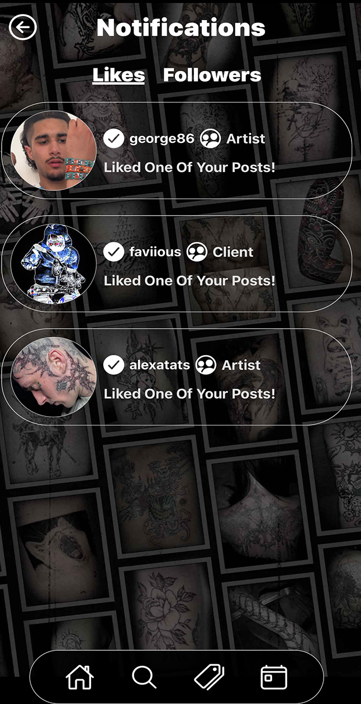
   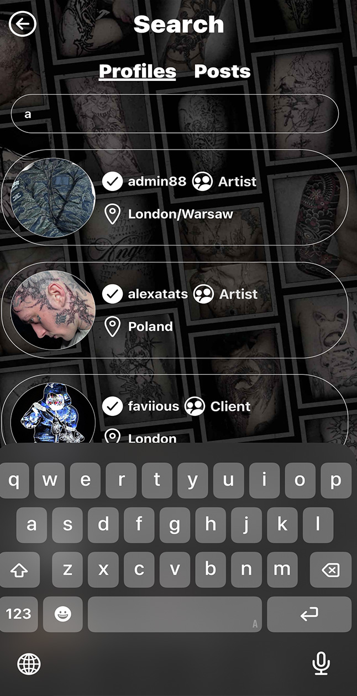

# Access

This repository contains the source code for FlashFinder.
The application depends on external Supabase environment variables, which are not included in this public submission.

For demonstration and marking, the intended access method is through the **Expo Go preview build / QR code** provided seperately. 

